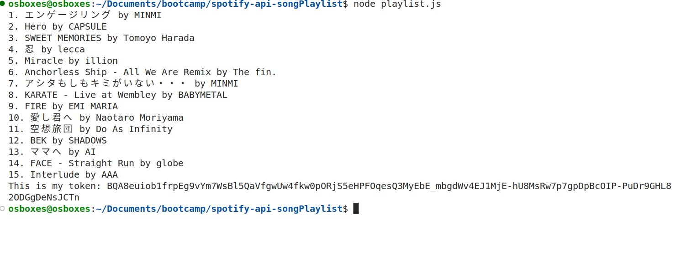

# spotify-api-songPlaylist
## nodejs

## You can click the below link to see the demo of this app
* https://www.loom.com/share/bf50ee1f0d75455ab86f371be4079a6d

## How to test this api
### Run the below git command in the terminal

- git clone git@github.com:vboxorcale/spotify-api-songPlaylist.git
- npm install
- node playlist.js 

### How to use this api
https://developer.spotify.com/documentation/web-api/reference/get-recommendations
- change the artist name in line 26 , market in line 53, seed_genres in line 54 and valence in line 55 in playlist.js The console in VScode will show the 15 recommendations tracks acording to the artist name which the user input at line 28.The valence value is a number between 0 and 1.There is a console log in line 79 to show that the refresh token.Every single time the user run the node playlist.js command on the console the token is refreshing.

### The backgroud of this project
This project supposed to have a reactjs frontend that fetch the data from the spotify API and display the song playlists with HTML format.(https://github.com/kwannieng/weather-playlist-2) *Unfortunately the spotify API authentication process is complicated and beyond our knowledge.We cannot figure out how to refresh the token in the frontend(https://developer.spotify.com/documentation/web-api/tutorials/code-flow) . *But can do at the backend like this project.

### The mechanisms of the code
- This code is written in Nodejs and it uses the axios library to make HTTP requests to the Spotify Web API. It also uses the base-64 library 
- The code defines a function getToken() that retrieves an access token from the Spotify Web API using client credentials authorization. It then defines a function searchForArtist(token, artistName) that searches for an artist by name using the access token and returns the first artist that matches the search query. If no artist is found, it logs a message and returns null.

- The code also defines a function getSongsByArtist(token, artistId) that retrieves song recommendations from the Spotify Web API for an artist with the given ID. The function uses a combination of market, seed genres, and target valence to retrieve recommended songs that match the specified criteria.

- Finally, the code defines a function main() that calls the getToken(), searchForArtist(), and getSongsByArtist() functions to retrieve a list of recommended songs for an artist named "MISIA" in this case. It then logs the name and artist of each recommended song to the console.

- The dotenv library is used to load environment variables from a .env file into the process.env 
